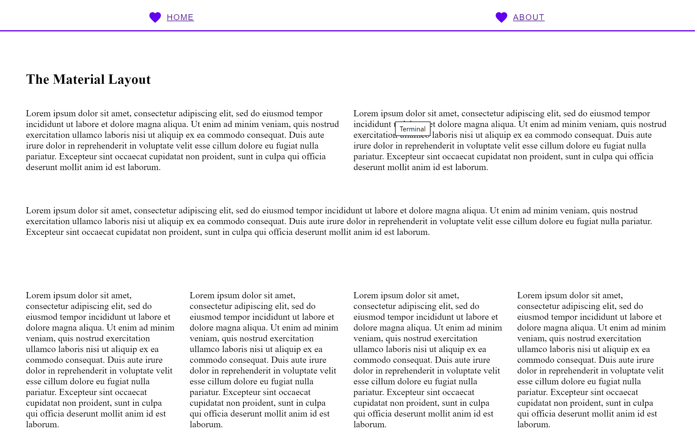
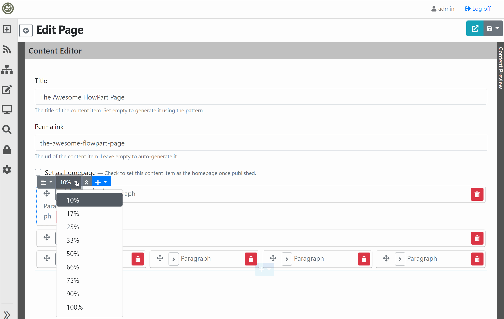
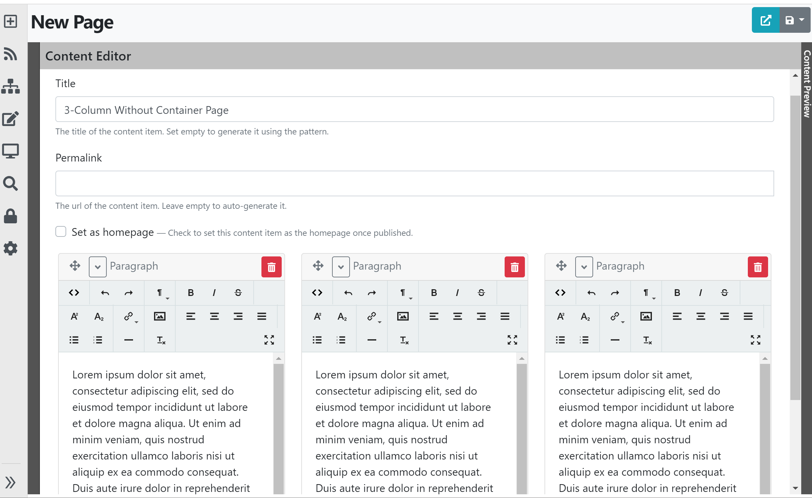
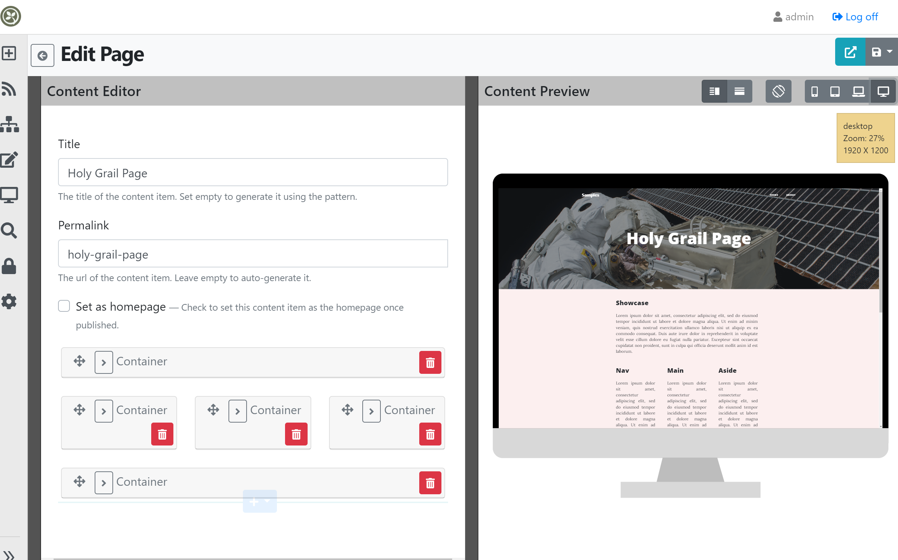

# Flows

## Introduction
Orchard Core Flows module allows you to design free flowing 2D web pages. Flows module defines `FlowPart` which allows you to add multiple `Widgets` to your web page. Each `Widget` added to `FlowPart` has `FlowMetadata` part attached. The `FlowMetadata` part allows you to define `FlowAlignment` and `Size` of the `widget` content item within your page.


Default implementation of `FlowPart` uses bootstrap grid system under the hood. `TheAdmin` theme uses bootstrap grid classes. Whereas for Frontend themes - the `Flows` module defines custom css classes. But it doesn't provide css implementation for these front-end classes. This provides Frontend themes a flexibility to implement grid system of their choice without needing to be dependent on bootstrap grid system.

`FlowPart` edit template in admin, uses `col-md-*` classes whereas Frontend display template uses `widget-size-*` and `widget-align-*` classes.


## Basic Usage

To try Flow module out-of-the box, Use either `TheAgency` theme or `TheBlog` theme. These themes define `Page` and `Container`  content types that uses `FlowPart`. 

Usage is very simple and it does not require any user manual. 

1. Setup a Orchard Core website with either `TheAgency` theme or `TheBlog` theme.
1. Create new Page 
1. Click on + to add widget content item.
1. Hover over Card header to to set Size and Alignment for widget content item.


### FlowMetadata 
`FlowMetadata` defines six different sizes out of the box. i.e `25%`, `33%`, `50%`, `66%`, `75%`, `100%` 

`FlowMetadata` defines four alignments out of the box. i.e `Left`, `Center`, `Right`, `Justify` 


## How it works out-of-the-box?

### Admin Experience

`TheAdmin` theme is implemented using bootstrap hence it's obvious that `FlowPart` editing experience is using bootstrap grid. The default implementation uses `col-md-*` classes of bootstrap grid to arrange widget content items.

Each `widget` content item in `Flows` is represented using `ContentCard` shape. Each content card shape has a outer frame `<div>` element defined using shape `ContentCard_Frame__FlowPart` in  Razor View `ContentCard-FlowPart.Frame.cshtml`.

While you edit widget - change the `Size` of widget from `100%` to `50%`. Notice that changes is reactive and widgets are rearranged. This is because css class for outer frame `<div>` is changed to `col-md-6` from `col-md-12` via `javascript`. This gives you live editing experience within Admin UI .


### Frontend Experience

Frontend display templates defines `widget-size-*` classes. It only provides definition - the implementation is left on to the theme. 

For the theme to work with `Flows` out-of-the-box `FlowPart` template, theme developer required to provide implementation for `CSS` classes `widget-size-25`, `widget-size-33`, `widget-size-50`, `widget-size-66`, `widget-size-75` and `widget-size-100`.

`TheAgency` and `TheBlog` themes provides implementation of these `CSS` classes. However these `CSS` classes are bootstrap grid based. 

So remember to create these classes in your new theme for `Flows` to work.


## Tip: #1 : When using with blank recipe - remember to create content type with FlowPart to use Flows.

`TheAgency` and `TheBlog` theme defines `Page` and `Container` content item out-of-the-box. That has `FlowPart` attached. While you are evaluating the OrchardCore CMS, it would be nice to use these themes, content types and content items created by these themes. 

However you may not want to use them in production as these themes comes with content recipe that creates some content types and content items that you might not need in production.

Also, these themes are not full fledged themes and their layout doesn't cover all the aspect of your needs. So it's better to start with your own theme that covers your scenarios.

Once you decided to use Blank Recipe, Remember to create content types  with `FlowPart` to use Flows. You can also create `Page`, `Container`, `Paragraph` and any other `widget` content types that you need in your project - You could use same definition  as provided in `TheAgency` and `TheBlog` theme recipes.

## Tip: #2 : Flows can use any CSS Layout system not just Bootstrap.

The default implementation of Flows is using bootstrap but not dependent on Bootstrap. As it is using `percentage` based units instead of `col-` based. It makes it easy to adopt any other CSS layout framework. For `Flows` to work with custom theme, theme developer need to provide `CSS` classes for `.flow` and `.widget-size-*`.

Following example shows implementation of `widget-size-25` using Google's Material Layout (other classes are removed for brevity)


```css
.flow {
    display: flex;
    flex-flow: row wrap;
    align-items: stretch;
    margin: -12px;
    margin: calc(var(--mdc-layout-grid-gutter-desktop, 24px) / 2 * -1);
  }
  @supports (display: grid) {
    .flow {
      display: grid;
      margin: 0;
      grid-gap: 24px;
      grid-gap: var(--mdc-layout-grid-gutter-desktop, 24px);
      grid-template-columns: repeat(12, minmax(0, 1fr));
    }
  }
 .widget-size-25 {
    width: calc(25% - 24px);
    width: calc(25% - var(--mdc-layout-grid-gutter-desktop, 24px));
    box-sizing: border-box;
    margin: 12px;
    margin: calc(var(--mdc-layout-grid-gutter-desktop, 24px) / 2);
  }
  @supports (display: grid) {
    .widget-size-25 {
      width: auto;
      grid-column-end: span 3;
    }
  }
  @supports (display: grid) {
    .widget-size-25 {
      margin: 0;
    }
  }
....
....
....
```

**The Result**




## Tip: #3 : Adding additional `Size` options to `FlowMetadata`.

You can easily add more size options by overriding `FlowMetadata_Edit` shape. You can override shape by either by creating `FlowMetadata.Edit.cshtml` or `FlowMetadata.Edit.liquid` in your web application's `Views` folder or by  creating `FlowMetadata_Edit` shape in Admin Template.

Following example adds `10%` and `90%` as additional size options.

```liquid
<label class="btn btn-secondary dropdown-item active">
     {{ "10%" | t }}
</label>
.....
.....
.....
<label class="btn btn-secondary dropdown-item active">
    {{ "90%" | t }}
</label>
<label class="btn btn-secondary dropdown-item active">
    {{ "100%" | t }}
</label>
```

and adding related `widget-size-10` and `widget-size-90` classes for Frontend as following.


```css
.widget-size-10{
    flex: 0 0 10%;
    max-width: 10%
}

.widget-size-90{
    flex: 0 0 90%;
    max-width: 90%
}
```
**The Result**



### Admin Experience

Admin experience is reactive to `10%` and `90%` as `javascript` is already converting percent size to bootstrap `col-md-*`.


## Tip: #4 : Flow columns without using nested container. 

Let's say you want to create three column page. Currently you can add three `33%` Containers and create content within each of them. That works. However you can't restrict content editor to have only three columns. 

Let's say you want fixed three column layout that content editor can't change while editing content. Are you thinking need of LayoutPart? 

No it's much simpler than that - can be achieved using just `CSS`. 

Define following in your CSS in your theme. 

```css
.flow {
  	display:grid;
    grid-gap: 1em;
    grid-template-columns: 1fr 1fr 1fr;
    grid-template-rows: 1fr;	
}
```

Here each `widget-size-*` classes will take the grid cell as it's `100%` parent container. Every new `widget` will be placed in the column.

**The Result**


### Admin Experience

You have noticed that the Admin experience is not reactive to 3-column in above image. No worries you can also achieve that by defining following `CSS` in your admin theme.


```css
.widget-template-placeholder-flowpart {
  	display:grid;
    grid-gap: 1em;
    grid-template-columns: 1fr 1fr 1fr;
    grid-template-rows: 1fr;	
}
```




## Tip: #5 : Fixed rows/columns - Holy Grail Page 

Let's say you want to create fixed columns/rows on your page with  `Showcase`, `Footer` with 3-col like `Nav`, `Main` and `Aside` in the middle.


|         | Showcase|         |
|---------|---------|---------|
|   Nav   |   Main  |  Aside  |
|         |  Footer |         |
|


This can be done with `CSS` and overriding `FlowMetadata_Edit` shape.
Override `FlowMetadata_Edit` by adding following options after `100%`

```liquid
<label class="btn btn-secondary dropdown-item     active">
{{ "Header" | t }}
</label>

<label class="btn btn-secondary dropdown-item     active">
{{ "Nav" | t }}
</label>

<label class="btn btn-secondary dropdown-item active">
{{ "Main" | t }}
</label>

<label class="btn btn-secondary dropdown-item active">
{{ "Aside" | t }}
</label>


<label class="btn btn-secondary dropdown-item active">
    {{ "Footer" | t }}
</label>
```


and define following in CSS. 


```css
.flow{
  	display:grid;  
    grid-gap: 1em;
    grid-template-areas:
    "showcase showcase showcase"
  	"nav main aside"
    "footer footer footer";
  }
  
  .widget-size-1000{
      grid-area: showcase
  }
  
  .widget-size-2001{
      grid-area: nav
  }
  
  .widget-size-2002{
  grid-area: main
  }
  
  .widget-size-2003{
      grid-area: aside
  }
  
  
  .widget-size-3000{
      grid-area: footer
  }
```

Each built in `widget-size-*` classes will work as expected as grid cell is it's container at `100%`

**The Result**

 


### Admin Experience

Admin experience can be achieve it by defining following `CSS` in admin theme.


```css
.widget-template-placeholder-flowpart{
  	display:grid;  
    grid-gap: 1em;
    grid-template-areas:
    "showcase showcase showcase"
  	"nav main aside"
    "footer footer footer";
  }
```




